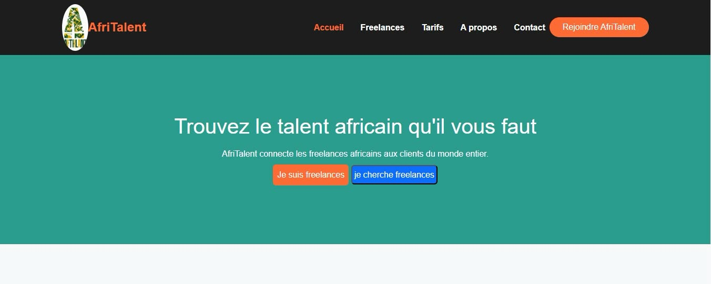
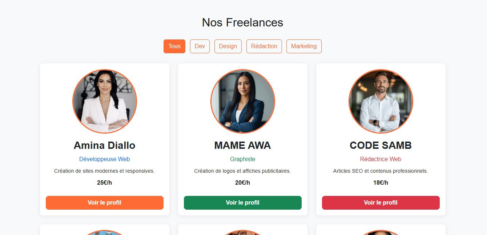
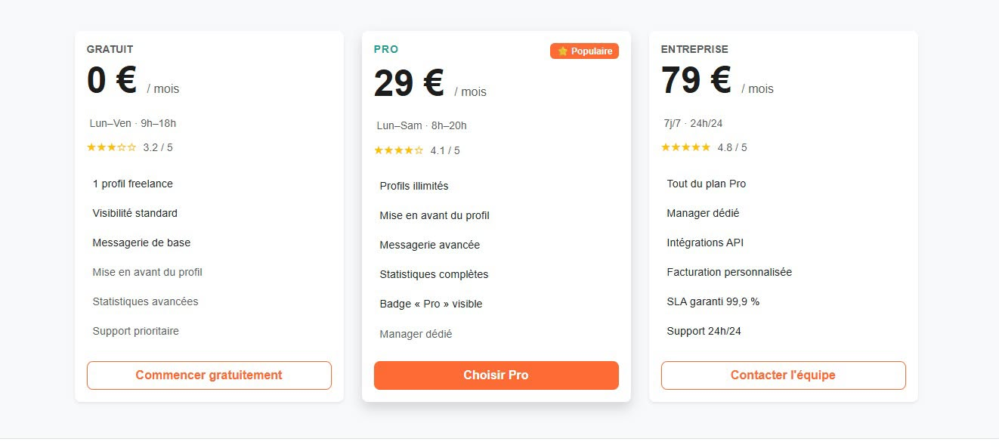
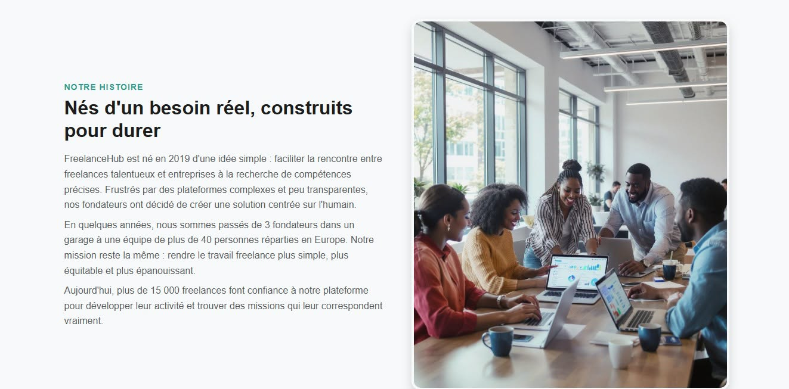
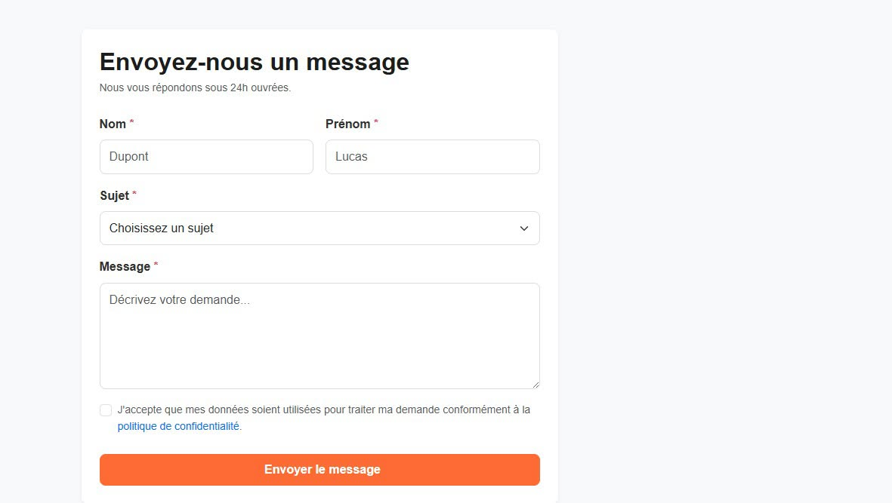

# AfriTalent 
Projet fil rouge — Plateforme de mise en relation entre freelances africains et 
clients. 
Auteur : BINETOU SECK
Promotion : L1 IAGE

# DESCRIPION
 Le marché du freelance tech en Afrique connaît une croissance explosive. Développeurs, designers et créateurs cherchent une plateforme fiable pour proposer leurs services et trouver des missions

 # Technologie utilisés
- HTML : Pour la structure des 5 pages
- CSS : Pour le style , le Bento grid , les animations et la responsivité
- Bosstrap : Pour la navbar , les cards , le carousel et les accordion
- Google Fonts : Pour les polices
- Javascript : Pour le theme clair , le compteur animé , le filtrage des carteset la validation du formulaire
- Github : Pour enregistrer chaque étpae de notre projet

# Les fonctionalités Javascript utilisées dans ce projet
- Dark mode et le Light mode : Integrer dans la navbar et sauvegardé dans localStorage
- Compteurs animés :qui s'incrémente de 0 à leur valeur finale
- Filtrage des cartes freelances par catégorie sans rechargement de la page
- Validation du formulaire: regex sur l'email, longueur minimum 20 caractères pour le message, messages d'erreur et de succes personnalisés
- Animations fade-in:les sections apparaissent en fondu à l'entrée dans le viewport

# Les pages du site d'AfriTalent

# Instructions pour lancer localement
1. Cloner le dépôt : git clone https://github.com/binetourassul/Binetou-seck--AfriTalent.git
2. Ouvrir le dossier du projet
3. Ouvrir le fichier index.html directement dans votre navigateur

# Ressources consultées
- MDN : Pour la documentation
- Youtube : Des vidéos tutoriel
- Font Awesome: Pour les icônes
- W3C Validator: Validation HTML
- Boostrap : Pour la navbar, les cards, le caroussel et les accordions

# lien github page: 
https://binetourassul.github.io/Binetou-seck--AfriTalent/